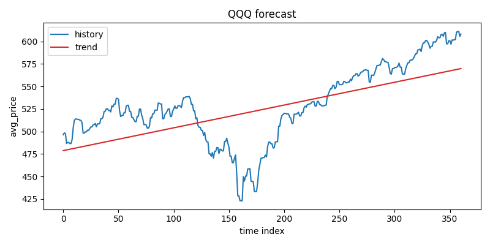

# DCA Investment Advisor

An experimental toolkit for exploring dollar-cost averaging (DCA) strategies with simple machine learning models.

## Disclaimer

This is a personal research project. It is **not** investing advice. Markets are risky and you could lose money if you follow these suggestions blindly. Review the code, understand the assumptions, and take responsibility for every trade.

## What It Does

- Downloads daily historical prices (and optional EPS data) for the tickers in your config.
- Fills gaps, normalizes the timeline, and stores clean CSVs for downstream modelling.
- Fits a simple trend forecast so the strategy can reason about expected price movement and uncertainty.
- Simulates many noisy price paths and grid-searches a parametric DCA rule to maximize risk-adjusted returns.
- Reports the top-ranked buy strategy and saves full search results for manual inspection.

## Requirements

- Python 3.11 (other 3.10+ versions might work, but the project is tested with 3.11).
- `pip` or `conda` to install dependencies from `requirements.txt`. Key libraries: `yfinance`, `pandas`, `torch`, `matplotlib`, `pyyaml`.

## Installation

```bash
# (optional) create a virtual environment
conda create --prefix ./venv python=3.11 -y
conda activate ./venv

# install dependencies
pip install -r requirements.txt
```

If you prefer plain `python -m venv venv`, remember to `source venv/bin/activate` before installing requirements.

## Configuration

All runtime settings live in `config.yaml`. A minimal example:

```yaml
output_dir: "./outputs"
columns:
  - avg_price

stock_symbols:
  - QQQ

stock_start_date: today-360
stock_end_date: today

simple_forecast_history_start_date: today-360
simple_forecast_history_end_date: today

train_buy_strategy:
  simulation_T: 12
  simulate_time_interval: 30
  simulation_batch_size: 4096
  buy_strategy_a_from: 0.0
  buy_strategy_a_to: 2.0
  buy_strategy_b_from: 0.0
  buy_strategy_b_to: 1.0
  buy_strategy_c_from: 0.0
  buy_strategy_c_to: 2.0
  buy_strategy_alpha: 0.5
  pred_std_multiplier: 1.5
  grid_size: 10
```

Key fields:

- `stock_symbols`: Tickers to fetch. Optional `etf_symbols` supplies legacy tickers whose EPS files are skipped.
- `stock_start_date` / `stock_end_date`: Inclusive window. Accepts ISO dates (`2023-01-01`) or relative tokens (`today-360`) parsed by `config_dates.py`.
- `columns`: Columns to expose in downstream datasets. The defaults work for the provided scripts.
- `simple_forecast_history_*`: Date range used when fitting the trend model.
- `train_buy_strategy`: Hyperparameters controlling the simulation horizon (`simulation_T`), sampling interval in days, batch size, grid search extents for the piecewise buy rule, and the risk penalty (`buy_strategy_alpha`).
- `output_dir`: Root directory where intermediate and final artifacts are written (`raw_data/`, `data/`, `forecast/`, `train_buy_strategy/`).

## Running The Pipeline

```bash
bash run.sh
```

The helper script performs the end-to-end workflow:

1. Moves the previous `outputs/` directory into `backups/outputs_<timestamp>` (create `backups/` ahead of time if it does not exist).
2. `download_data.py` pulls price data with `yfinance` and writes CSVs to `outputs/raw_data/`.
3. `impute_data.py` aligns the date index, fills gaps using nearest values, adds timestamps, and saves clean series to `outputs/data/`.
4. `simple_forecast.py` fits the trend model, exports JSON parameters, and plots per-ticker diagnostics in `outputs/forecast/`.
5. `train_buy_strategy.py` simulates price paths, scores every `{a, b, c}` combination, stores the full table under `outputs/train_buy_strategy/`, and prints the best candidate.

You can run the scripts individually (they all accept `--config path/to/config.yaml`).

## Reading The Output

When the pipeline finishes you will see a summary similar to:

```
QQQ: best a=0.8889, b=1.0000, c=0.2222 -> total=1.1816, std=0.1304, score=1.1164, initial spend=0.1993, initial shares=0.0003, price=608.1367
```

Interpretation:

- Spend ~19.9% of your remaining cash (`initial spend`) on QQQ at the next rebalance (`initial stock price`).
- The grid search estimates an average terminal wealth of `total` with standard deviation `std` over the 12 simulated months.
- `score` applies the risk penalty, i.e. `mean_total - alpha * std`.
- The full CSV (`outputs/train_buy_strategy/QQQ.csv`) lists every combination and includes additional aggregates (`mean_stock_shares`, `mean_cash`, etc.) for deeper analysis.

You can find the visualization of the price prediction model in `outputs/forecase/<stock_symbol>.png` , for example:



## How It Works

**Data ingestion** — `download_data.py` queries `yfinance` for daily bars (`High`, `Low`, `Close`), computes a simple average price per day, and stores one CSV per ticker. Optional EPS series are merged if `raw_data/<symbol>_eps.csv` exists. `impute_data.py` builds a complete daily index between `stock_start_date` and `stock_end_date`, inserts missing rows, and fills gaps by copying the nearest available price/EPS observation. It also adds a Unix `timestamp` column required by other components.

**Price forecast** — `simple_forecast.py` loads the cleaned `avg_price` series (restricted to the configured history window) and converts it to a PyTorch tensor. It fits a weighted linear trend `price_hat(t) = k * (t - T) + b` by minimizing the relative squared error `((price_hat - price) / price)^2`. The closed-form solution yields `pred_k` and `pred_b`, while `pred_std` captures the root mean squared relative error (an uncertainty proxy). The script exports these parameters to JSON and produces diagnostic plots so you can eyeball the fit.

**Strategy simulation** — `train_buy_strategy.py` treats the trend as a baseline forecast. For each ticker it:

- Uses the last observed price as the starting point (`init_price`).
- Samples noisy trajectories of length `simulation_T`, stepping `simulate_time_interval` days at a time. The linear trend provides the mean, and multiplicative Gaussian noise scaled by `pred_std_multiplier × pred_std` injects volatility.
- Applies a parametric DCA policy defined by three scalars `{a, b, c}` describing a piecewise-linear purchase fraction as a function of `r = price / predicted_price`. When prices look cheap (`r` near 0) the rule can spend up to 100% of remaining cash; as `r` increases towards `a + c`, spending tapers to zero.
- Evaluates every `{a, b, c}` tuple from the configured grid, records the terminal cash + equity value for each sampled trajectory, and computes its mean, standard deviation, and risk-adjusted score `mean - alpha × std`.

The top-scoring configuration is printed and the full table is saved so you can audit or tune the selection.

## Limitations & Next Steps

- The price forecast is a first-order trend line; it ignores seasonality, macro events, and regime shifts.
- The simulator uses independent Gaussian noise with constant variance, so fat tails and clustering are not captured.
- Taxes, fees, and position sizing across multiple tickers are out of scope.

Feel free to fork the project and experiment with alternative models, scoring metrics, or portfolio-level allocation rules.

## License

This project is distributed under the terms of the [MIT License](LICENSE).
